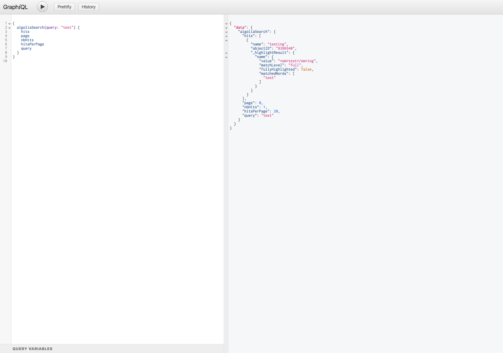

<p align="center">
    <h3 align="center">GraphQL Algolia API Types</h3>
    <p align="center"><em>Integrate Algolia into your GraphQL API</em><p>
</p>




## Disclaimer

This project is highly experimental, and not yet on npm. If you would like to try it out clone the rep and go to the examples folder to see how it works

## Usage

```javascript
const express = require('express');
const graphqlHTTP = require('express-graphql');
const algoliasearch = require('algoliasearch');
const { GraphQLSchema, GraphQLObjectType, GraphQLString } = require('graphql');
const { GraphQLAlgoliaSearchType } = require('../../src');

const client = algoliasearch(
  process.env.ALGOLIA_APP_ID,
  process.env.ALGOLIA_APP_KEY
);
const index = client.initIndex(process.env.ALGOLIA_INDEX_NAME);

var schema = new GraphQLSchema({
  query: new GraphQLObjectType({
    name: 'Root',
    fields: {
      hello: {
        type: GraphQLString,
        resolve() {
          return 'world';
        },
      },
      algoliaSearch: new GraphQLAlgoliaSearchType({ index }),
    },
  }),
});

const app = express();

app.use(
  '/graphql',
  graphqlHTTP({
    schema: schema,
    graphiql: true,
  })
);

app.listen(3000);
```
